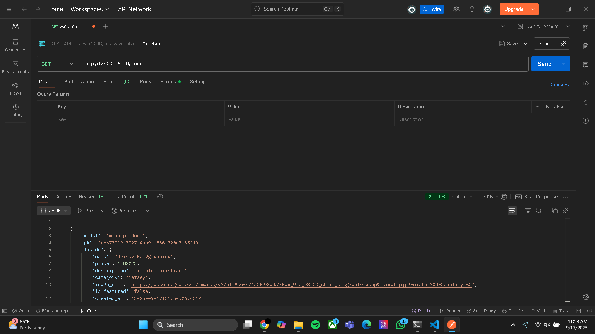
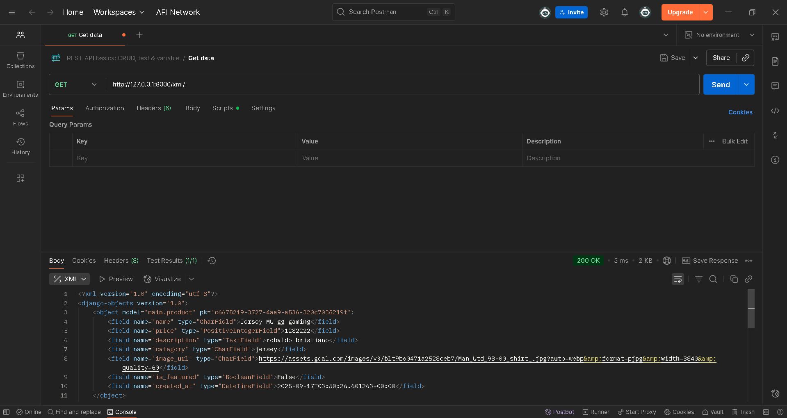

1. Jelaskan mengapa kita memerlukan data delivery dalam pengimplementasian sebuah platform?

## jawaban: agar dapat bisa diambil oleh orang lain serta juga memungkinkan integrasi menggunakan API

2. Menurutmu, mana yang lebih baik antara XML dan JSON? Mengapa JSON lebih populer dibandingkan XML?

## jawaban: menurut saya lebih bagus JSON, karena JSON lebih praktis dibandingkan XML, serta juga ringan dan JSON udah memakai ekosistem API yang modern seperti GraphQL yang biasanya orang2 pakai JSON

3. Jelaskan fungsi dari method is_valid() pada form Django dan mengapa kita membutuhkan method tersebut?

## jawaban: is_valid() itu menjalankan validasi berdasarkan tipe field, kauak wajob atau tidaknya, seberapa panjang dan format2nya. dan kenapa perlu? ya tentu aja untuk security, membuang input yang gak valid agar konsistensi data juga. saat masuk Data Base udah sesuai aturan

4. Mengapa kita membutuhkan csrf_token saat membuat form di Django? Apa yang dapat terjadi jika kita tidak menambahkan csrf_token pada form Django? Bagaimana hal tersebut dapat dimanfaatkan oleh penyerang?

## jawaban:karena untuk mencegah serangan CSRF yang dimana serangan ini menyuruh browser korban mengirim form ke situs lain tanpa sepengetahuan dia, tanpa token sang penyerang bisa aja membuat halaman form tersembunyi yang auto submit ke endpoint. bisa aja mereka juga ubah data atau ubah profil. penyerang juga memanfaatkan sifat browser yang mengirimkan cookie

5. Jelaskan bagaimana cara kamu mengimplementasikan checklist di atas secara step-by-step (bukan hanya sekadar mengikuti tutorial).

## jawaban: 1. saya membuat model terlebih dahulu yang sesuai dengan tugas dan saya menambahkan kategori dan juga image untuk thumbnail. 
## 2. setelah itu saya membuat form untuk menampilkan field yang sudah dibuat
## 3. setelah itu nambahin beberapa fungsi kedalam views seperti show_product dan create_product
## 4. saya juga menambahkan untuk melihat XML dan JSON
## 5. pada template juga saya membuat create_product dan juga product_detail

6. Apakah ada feedback untuk asdos di tutorial 2 yang sudah kalian kerjakan?

## jawaban: dari aku sendiri udah aman banget dan seru tutorialnya sambil dipelajari

## screenshoot

